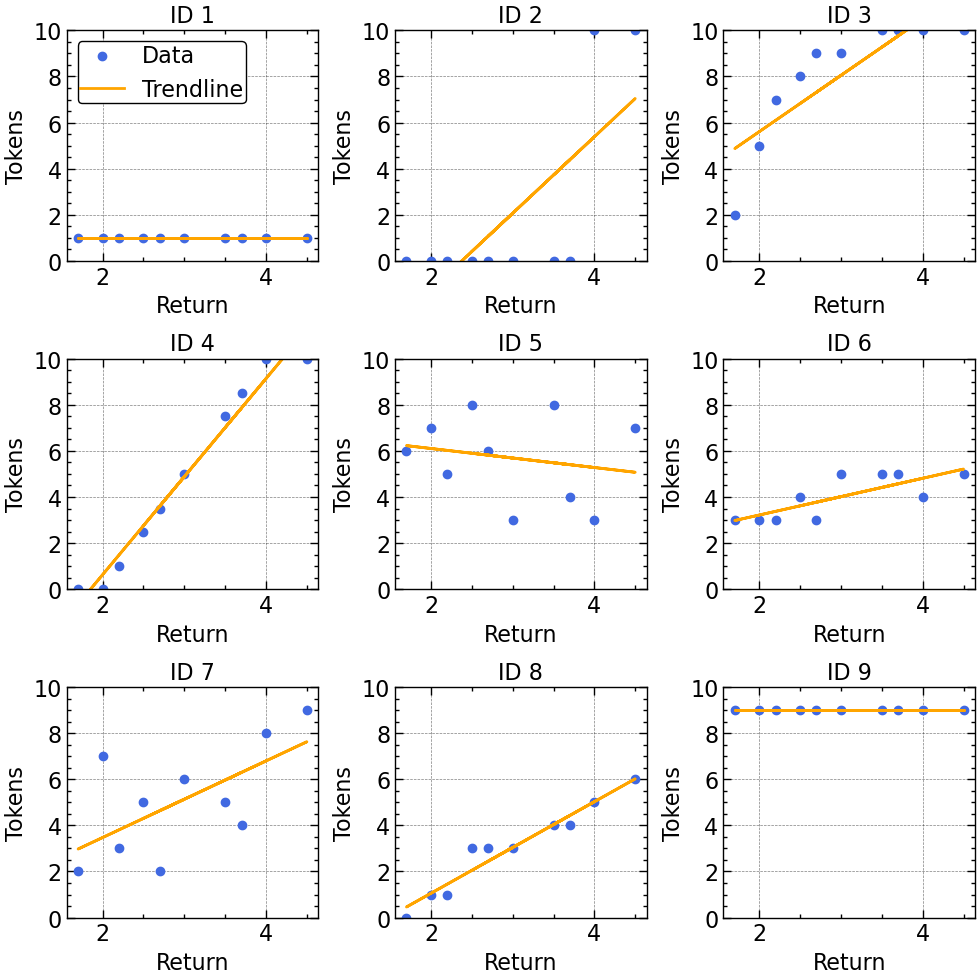
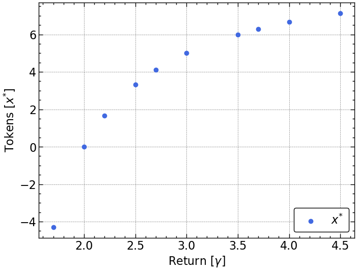
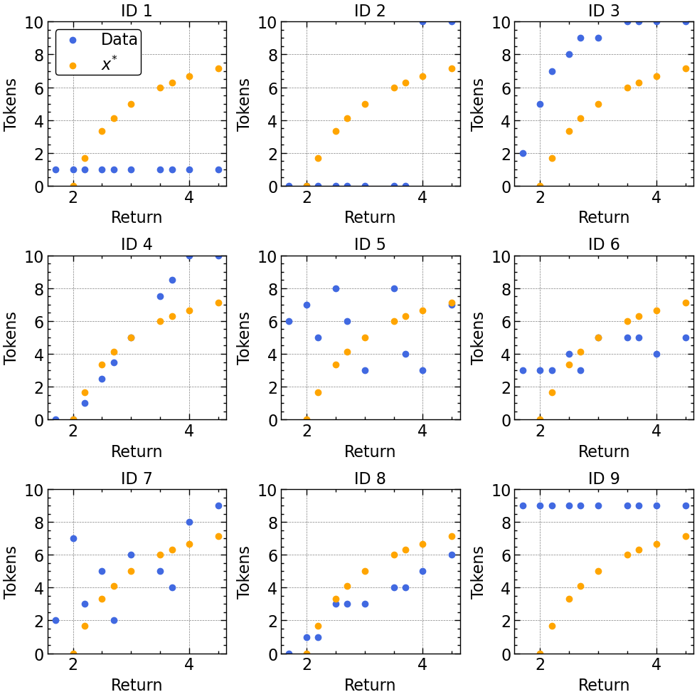

# 9 Problem set 3: Investment game ~ Jackson Dienes

# 9.2 Data description
The experiment’s data is in an excel spreadsheet with two tabs. The decisions you made are in the data tab, and a description of each investment decision is in the returns tab.

Each row of the data tab corresponds to a different person in the experiment. You will only need the Invested x columns of this tab. For example, Invested 1 describes how much each person invested in the first risk asset, which is described in the first row of the returns tab.

# 9.3 Questions


```python
import pandas as pd
import numpy as np
import matplotlib.pyplot as plt
import scienceplots
plt.style.use(['science','notebook','grid'])
```

### 1. Make a plot with the return of the risky asset on the horizontal axis, and the tokens invested in the risky asset on the vertical axis. Comment on any patterns you see. The data will be a lot easier to visualize if you make one plot for each participant. You can do tis in R and ggplot using the facet_wrap() function.


```python
# Read in the data from Excel file
df_returns = pd.read_excel('2023PS03InvectmentGame.xlsx', sheet_name='returns', usecols=["HighReturn"])
df_invested = pd.read_excel('2023PS03InvectmentGame.xlsx', sheet_name='invested', usecols=['ID1','ID2','ID3','ID4','ID5','ID6','ID7','ID8','ID9'])

# Create a scatter plot for each person
fig, axs = plt.subplots(nrows=3, ncols=3, figsize=(10, 10))

for i, ax in enumerate(axs.flat):
    if i < 9:
        data = pd.concat([df_returns, df_invested[f'ID{i+1}']], axis=1)
        data = data.dropna()
        x = data['HighReturn']
        y = data[f'ID{i+1}']
        ax.scatter(x, y, color="royalblue",label="Data")
        ax.set_xlabel('Return')
        ax.set_ylabel('Tokens')
        ax.set_title(f'ID {i+1}')
        ax.set_ylim([0, df_invested.max().max()])
        m, b = np.polyfit(x, y, 1) 
        ax.plot(x, m*x + b, color='orange',label="Trendline") # Plot the trendline
        
        if i == 0:
            ax.legend(loc='upper left',borderpad=.1,fancybox='false',edgecolor='black')
            
plt.tight_layout()
plt.show()
```


    

    


Some obvious patterns emerge when looking at the trendlines that I added to each graph. Most of the class has an upward sloping graph, meaning as the return of the risky asset increased, they invested more tokens. This is interesting as it means most of the class is risk averse, which we will see a bit more in question 4.

### 2. Derive predictions for what a person would do if they wanted to maximize expected value. That is, for each decision, predict how much an expected value-maximizer would invest in the risky asset. Comment on whether or not these predictions organize the data in your plot well. Hint: The probability of the high return is always 12, and all but two of the high returns are strictly greater than 2.

$$\large Eu = \frac{1}{2} u (10-x) + \frac{1}{2} u(10-\gamma x)$$

$$ = \large \frac{1}{2}(10-x)^{r}+\frac{1}{2}(10-x+\gamma x)^{r}$$

$$\large \frac{\delta Eu}{\delta x} = \frac{-1}{2}r(10-x)^{r-1}+\frac{1}{2}r(10-x+\gamma x)^{r-1}(\gamma-1)$$

#### We want to maximize this function by setting it equal to 0:

$$\large 0 = \frac{-1}{2}r(10-x^{*})^{r-1}+\frac{r}{2}(10-x^{*}+\gamma x^{*})^{r-1}(\gamma-1)$$

$$\large (10-x^{*})^{r-1} = (10+(\gamma-1)x^{*})^{r-1}(\gamma-1) $$

$$\large ((10-x^{*})^{r-1})^{\frac{1}{r-1}} = ((10+(\gamma-1)x^{*})^{r-1}(\gamma-1))^{\frac{1}{r-1}}$$

$$\large 10-x^{*}=(10+(\gamma-1)x^{*})(\gamma-1)^{\frac{1}{r-1}}$$

$$\large 10=(10+(\gamma-1)x^{*})(\gamma-1)^{\frac{1}{r-1}}+x^{*}$$

$$\large 10-10(\gamma-1)^{\frac{1}{r-1}}=x^{*}[(\gamma-1)(\gamma-1)^{\frac{1}{r-1}}+1]$$

$$\large x^{*} = \frac{10 (1-(\gamma-1)^{\frac{1}{r-1}})} {(\gamma-1)^{1+\frac{1}{r-1}}+1)}$$

### 3. Derive predictions for what a person would do if they wanted to maximize expected utility, and had a utility function of $u(x)=\sqrt x$. Add these predictions to your plot. (we will work on this on class). It is OK to do this either numerically (e.g. in a spreadsheet) or analytically (pen and paper)

$$\large U(x) = x^{r}$$

$$\large U(x) = x^{\frac{1}{2}}$$

$$\large x^{*} = \frac{10 (1-(\gamma-1)^{\frac{1}{.5-1}})} {(\gamma-1)^{1+\frac{1}{.5-1}}+1)} $$


```python
import sympy as smp
from sympy import *
```


```python
x, gamma, r, xstr = smp.symbols('x gamma r x^{*}')
expr = 10*(1 - (gamma - 1)**(1/(r - 1))) / ((gamma - 1)**(1 + 1/(r - 1)) + 1)
expr.subs(r,smp.Rational(.5))
```


$\displaystyle \frac{10 - \frac{10}{\left(\gamma - 1\right)^{2}}}{1 + \frac{1}{\gamma - 1}}$


```python
#define variables as symbols in sympy
x, gamma, r, xstr = smp.symbols('x gamma r x^{*}')
expr = 10*(1 - (gamma - 1)**(1/(r - 1))) / ((gamma - 1)**(1 + 1/(r - 1)) + 1)
r_val = 0.5
expr_sub = expr.subs(r, r_val)
x_func = smp.lambdify([gamma], expr_sub.subs(x, xstr), 'numpy')

# Evaluate the function at each value of HighReturn then plot
x_vals = df_returns.values.ravel()
y_vals = x_func(x_vals)
plt.scatter(x_vals, y_vals, color='royalblue',label='$x^{*}$')
plt.xlabel('Return $[\gamma]$')
plt.ylabel('Tokens $[x^{*}]$')
plt.legend(loc='lower right',borderpad=.5,fancybox='false',edgecolor='black')
plt.show()
```


    

    


```python
fig, axs = plt.subplots(nrows=3, ncols=3, figsize=(10, 10))

for i, ax in enumerate(axs.flat):
    if i < 9:
        data = pd.concat([df_returns, df_invested[f'ID{i+1}']], axis=1)
        data = data.dropna()
        x = data['HighReturn']
        y = data[f'ID{i+1}']
        ax.scatter(x, y, color="royalblue", label="Data")
        
        expr = 10*(1 - (gamma - 1)**(1/(r - 1))) / ((gamma - 1)**(1 + 1/(r - 1)) + 1)
        r_val = 0.5
        expr_sub = expr.subs(r, r_val)
        x_func = smp.lambdify([gamma], expr_sub.subs(x, xstr), 'numpy')
        x_vals = data['HighReturn'].values.ravel()
        y_vals = x_func(x_vals)
        ax.scatter(x_vals, y_vals, color='orange', label="$x^{*}$")
        
        ax.set_xlabel('Return')
        ax.set_ylabel('Tokens')
        ax.set_title(f'ID {i+1}')
        ax.set_ylim([0, df_invested.max().max()])
        
        if i == 0:
            ax.legend(loc='upper left',borderpad=.1,fancybox='false',edgecolor='black')
            
plt.tight_layout()
plt.show()
```


    

    


### 4. Does the utility function you used in the previous question describe the behavior of someone who is risk-neutral, risk-averse, or risk-loving. Explain your answer, and explain how we can tell that most people have this kind of risk preference by looking at the plot.

The utility function $Eu = \sqrt{x}$ is a risk averse personality. As we can see, most of the actual data from the class expirement lines up pretty closely with the theoretical best result of a risk averse personality, or at least matches the shape of a concave graph. If we look at the trendlines in the first graph, 6 out of the 9 participants have an upward sloping graph, which can be thought of as more concave than not. They prefer the expected value of a lottery to the lottery itself.
